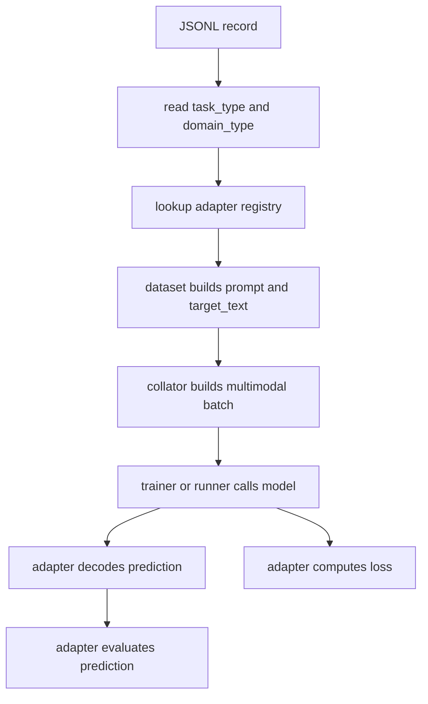
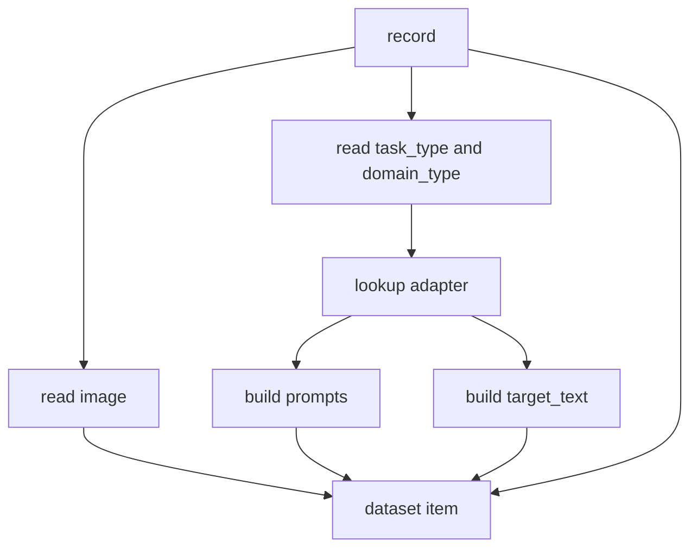
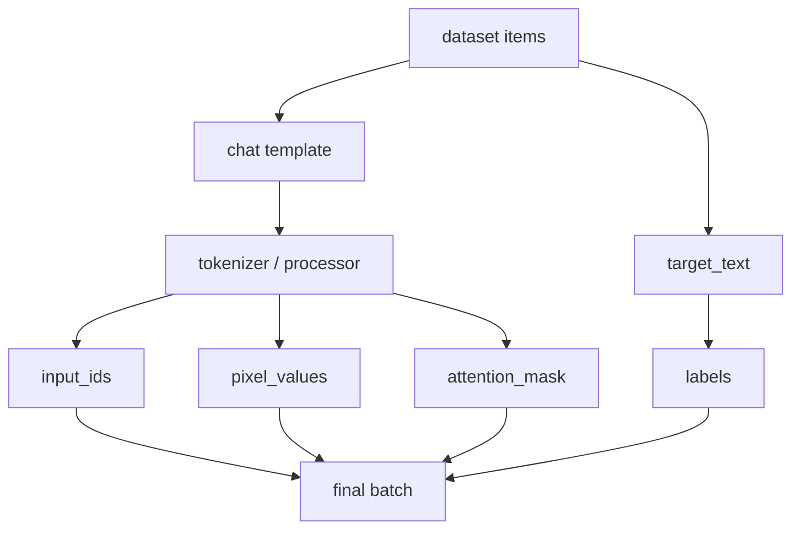
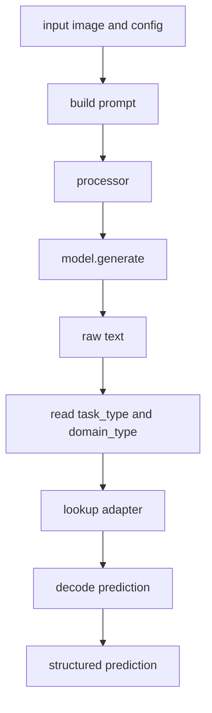
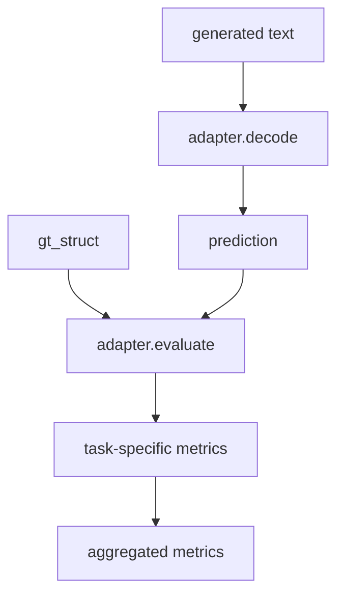
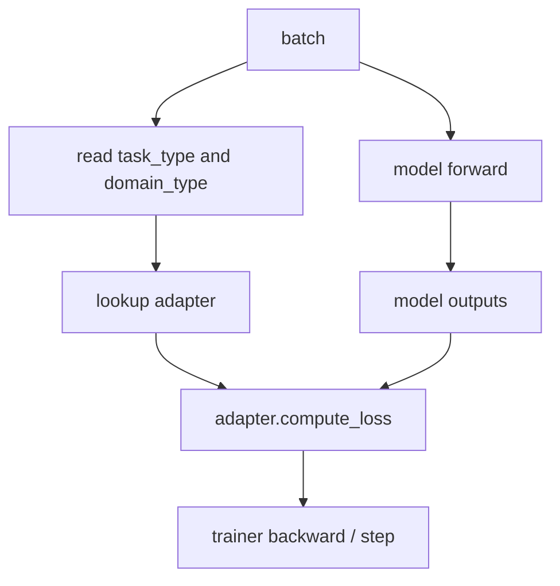

# Task / Domain Routing

这份文档描述一个更稳的抽象方向：

- `task_type`：模型这次要做什么
- `domain_type`：模型这次在处理什么对象语义

当前仓库里的箭头任务可以自然落成：

- `task_type=grounding`
- `task_type=keypoint_sequence`
- `task_type=joint_structure`
- `domain_type=arrow`

核心原则：

- `task_type` 和 `domain_type` 必须解耦
- `core` 只负责训练/推理框架
- 具体的 prompt、target、decode、metric、loss 都通过 `task_type + domain_type` 路由

## 概念分工

### task_type

`task_type` 定义：

- 输出协议
- prompt contract
- target_text 编码方式
- decode 逻辑
- eval 指标
- loss/objective

建议的任务类型：

- `grounding`
- `keypoint_sequence`
- `joint_structure`

### domain_type

`domain_type` 定义：

- label vocabulary
- 实例字段语义
- ordering 规则
- 数据准备规则
- domain-specific 可视化

当前 domain：

- `arrow`

## 当前三类任务的对应关系

### grounding

输入：

- 整图或 tile

输出：

```json
[
  {"label":"single_arrow","bbox_2d":[x1,y1,x2,y2]}
]
```

当前对应：

- Stage1

### keypoint_sequence

输入：

- 单目标 crop
- crop-local `label + bbox_2d`

输出：

```json
{"keypoints_2d":[[x0,y0],[x1,y1],...]}
```

当前对应：

- Stage2

### joint_structure

输入：

- 整图

输出：

```json
[
  {
    "label":"single_arrow",
    "bbox_2d":[x1,y1,x2,y2],
    "keypoints_2d":[[x0,y0],[x1,y1],...]
  }
]
```

当前对应：

- one-stage 直接输出全部

## 总体路由图



## Dataset 子流程

目标：

- dataset 不再写死箭头字段
- dataset 只负责读样本和调用 adapter



建议职责：

- `dataset`
  - 读取 JSONL
  - 打开图像
  - 读取 `task_type + domain_type`
  - 通过 adapter 构造：
    - `system_prompt`
    - `user_prompt`
    - `target_text`

- `adapter`
  - 解释 record
  - 决定 prompt 模板
  - 决定 target 文本协议

## Collator 子流程

`collator` 应该尽量保持 task-agnostic。



建议：

- `collator` 不理解：
  - `bbox`
  - `keypoints`
  - `single_arrow`
  - `double_arrow`

它只处理：

- image
- prompt
- target_text

## Runner 子流程

目标：

- runner 不再直接 import 某个具体 codec
- runner 负责生成，adapter 负责 decode



建议职责：

- `runner`
  - prepare inputs
  - generate
  - collect raw text / metadata

- `adapter`
  - decode
  - strict/lenient parse
  - task-specific postprocess

## Evaluator 子流程

目标：

- evaluator 只做调度和聚合
- 具体指标下沉到 adapter



建议职责：

- `core evaluator`
  - 批量 generate
  - 聚合数值
  - 做分布式 reduce

- `adapter`
  - 单样本评价
  - 返回任务相关指标

## Trainer 子流程

当前仓库主要是 SFT/CE loss，但后面如果有新任务，需要额外 loss，就不能再把 loss 写死在 trainer 里。



建议职责：

- `trainer`
  - forward / backward / optimizer / scheduler
  - checkpoint / logging

- `adapter`
  - 默认 SFT loss
  - 或未来扩展：
    - bbox auxiliary loss
    - point-count loss
    - consistency loss
    - matching loss

## Registry 设计

建议增加一层 registry：

```python
adapter = registry.get(
    task_type=record["task_type"],
    domain_type=record["domain_type"],
)
```

adapter 至少提供：

- `build_prompts(record)`
- `build_target_text(record)`
- `decode_prediction(text, image_width, image_height, strict=False)`
- `evaluate_prediction(prediction, gt_struct)`
- `compute_loss(model_outputs, batch)`

## 推荐目录草案

```text
src/vlm_det/
  core/
    data/
      collator.py
      dataset.py
    infer/
      config.py
      runner.py
    eval/
      evaluator.py
    train/
      trainer.py
      optim.py
    modeling/
      builder.py
    utils/
      ...
    registry.py

  tasks/
    grounding/
      adapter.py
    keypoint_sequence/
      adapter.py
    joint_structure/
      adapter.py

  domains/
    arrow/
      schema.py
      ordering.py
      visualize.py
      prepare.py
      two_stage.py
```

这里的职责分工是：

- `tasks/`
  - 输出协议和训练目标
- `domains/`
  - 对象语义和结构规则

## 对当前仓库的映射

### `grounding + arrow`

- 现在的 Stage1

### `keypoint_sequence + arrow`

- 现在的 Stage2

### `joint_structure + arrow`

- 现在的一阶段直接输出全部

## 落地顺序

建议按这个顺序重构：

1. 数据准备阶段统一写入：
   - `task_type`
   - `domain_type`
2. 增加 registry 和 adapter 接口
3. 先改 `dataset`
4. 再改 `runner`
5. 再改 `evaluator`
6. 最后给 `trainer` 增加可选 `compute_loss` 路由

不要反过来。真正的耦合点在：

- `dataset`
- `runner`
- `evaluator`
- `loss/objective`
